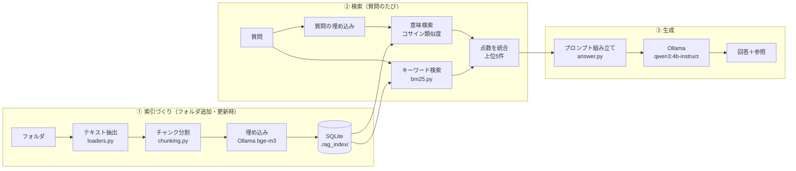

# folder-rag-ja の構造

このプログラムが「フォルダの文書を読み、質問に答える」までに何をしているかを、RAG の流れに沿って説明します。
`ファイル:行` はクリックすると該当箇所に飛べます（行番号は執筆時点のもの）。

**詳しい解説**
- [チャンクとは（具体例つき）](CHUNKING.md) — 3.3 節の詳細

---

## 1. 全体像

### RAG とは

RAG（Retrieval-Augmented Generation：検索拡張生成）は、**LLM に答えさせる前に、関係する資料を検索して一緒に渡す**方式です。
LLM は自分が学習していない社内マニュアルの中身を知りません。そこで、

1. 質問に関係しそうな文章を資料の中から探し（**検索 = Retrieval**）
2. その文章を「資料」として質問と一緒に LLM に渡し、それだけを根拠に答えさせる（**生成 = Generation**）

という 2 段階にします。LLM を学習し直す必要がなく、資料を差し替えればすぐ反映され、回答の根拠（出典）を示せるのが利点です。

### このアプリの 3 つの段階



- **①** は重い処理（埋め込みの計算）なので、事前に 1 回だけ行い、結果を保存しておきます。2 回目以降は変わったファイルだけ処理します。
- **②③** は質問のたびに行います。②は 0.1 秒程度、③が待ち時間のほぼすべて（CPU で 20 秒前後）です。

---

## 2. ファイル構成

| ファイル | 行数 | 役割 | RAG の段階 |
|---|---|---|---|
| [rag_chat/loaders.py](../rag_chat/loaders.py) | 105 | md / txt / pdf / docx からテキストを取り出し、見出しやページ単位の「セクション」にする | ① |
| [rag_chat/chunking.py](../rag_chat/chunking.py) | 36 | セクションを約 500 文字の「チャンク」に分ける | ① |
| [rag_chat/index.py](../rag_chat/index.py) | 305 | 索引（SQLite）の作成・差分更新、複数フォルダの検索 | ①② |
| [rag_chat/bm25.py](../rag_chat/bm25.py) | 60 | 日本語向けのキーワード検索（BM25） | ② |
| [rag_chat/answer.py](../rag_chat/answer.py) | 45 | LLM への指示文と資料の組み立て、引用番号の読み取り | ③ |
| [rag_chat/ollama_client.py](../rag_chat/ollama_client.py) | 75 | Ollama の HTTP API の呼び出し（標準ライブラリのみ） | ①②③ |
| [rag_chat/config.py](../rag_chat/config.py) | 69 | 設定（config.toml）と画面の状態（state.json）の読み書き | — |
| [rag_chat/\_\_main\_\_.py](../rag_chat/__main__.py) | 64 | CLI（`index` / `ask`）。UI を通さずに各段階を確かめる用 | — |
| [app.py](../app.py) | 337 | Streamlit の画面 | — |
| [tests/](../tests/) | 195 | 自動テスト（Ollama なしで動くもの） | — |

依存パッケージは `streamlit`（画面）、`numpy`（ベクトル計算）、`pypdf`（PDF）、`python-docx`（Word）の 4 つだけです。
ベクトルデータベースや LangChain のような RAG フレームワークは使わず、各段階を自前の短いコードで書いています。**仕組みを読んで理解できる**ことを優先した構成です。

---

## 3. ① 索引づくり

入口は [`FolderIndex.update()`](../rag_chat/index.py#L152)（[rag_chat/index.py:152](../rag_chat/index.py#L152)）です。

### 3.1 ファイルを集める — `scan_files()`

[rag_chat/index.py:52](../rag_chat/index.py#L52)。フォルダを再帰的にたどり、対応形式（`.md` `.markdown` `.txt` `.pdf` `.docx`）のファイルを集めます。
隠しフォルダ（`.` で始まる）と Office の一時ファイル（`~$` で始まる）は除きます。

### 3.2 テキストを取り出す — `load_file()`

[rag_chat/loaders.py:20](../rag_chat/loaders.py#L20)。形式ごとにテキストを取り出し、**出典の位置（location）付きのセクション**のリストにします。

| 形式 | 区切り方 | location の例 |
|---|---|---|
| Markdown | 見出し（`#`〜`######`）ごと。コードブロック内の `#` は見出しとみなさない | `経費精算マニュアル > 締め日と支払日` |
| Word | 見出しスタイル（Heading n / 見出し n）ごと。表は最後にまとめて追加 | `手順 > 申請方法` |
| PDF | ページごと（`pypdf` で文字を抽出） | `p.3` |
| テキスト | ファイル全体で 1 つ | （空） |

見出しの階層を location として残しておくのは、回答に「どこに書いてあったか」を示すためです。
**画像の中の文字は取り出せません**（OCR は行っていません）。スクリーンショットで説明している手順は検索にかかりません。

### 3.3 チャンクに分ける — `split_text()`

[rag_chat/chunking.py:8](../rag_chat/chunking.py#L8)。セクションを約 `chunk_size`（既定 500）文字の**チャンク**に分けます。チャンクは検索の最小単位で、LLM に渡す資料の単位にもなります。

- まず段落（空行）の区切りで分け、size を超えない範囲で段落をつなげます。
- 1 段落だけで size を超える場合は、文字数で切ります。その際、前のチャンクと `chunk_overlap`（既定 80）文字重ねて、切れ目で文が途切れても前後の文脈が残るようにします。

**チャンクの大きさはトレードオフです。** 小さいと検索は的確になりますが、1 つのチャンクに答えの一部しか入らなくなります。大きいと文脈は残りますが、無関係な文も一緒に入り、検索の精度と LLM の読みやすさが落ちます。

→ 実際のサンプルデータを切った例と、大きさを変えたときの違いは [チャンクとは（具体例つき）](CHUNKING.md) にまとめています。

### 3.4 埋め込み（ベクトル化）— `_embed_chunks()`

[rag_chat/index.py:215](../rag_chat/index.py#L215)。各チャンクを Ollama の `bge-m3` で**埋め込み**、1024 個の数値の並び（ベクトル）に変換します。
意味の近い文章ほど、ベクトルの向きが近くなるように学習されたモデルです。たとえば「立て替えたお金が戻る」と「翌月 10 日に振り込まれる」は、言葉が違っても近い向きになります。これが②の意味検索の土台です。

- 16 チャンクずつまとめて送ります（`EMBED_BATCH`）。
- 埋め込む前に、**チャンクの先頭にファイル名と見出しを付けます**（[`_with_header()`](../rag_chat/index.py#L301)）。たとえば「締め日と支払日」の本文には「締め日」という語が入っていなくても、見出しの語で検索にかかるようにするためです。
- ベクトルは長さ 1 に正規化して保存します。こうすると、②で内積を取るだけでコサイン類似度になります。

### 3.5 保存 — SQLite

[rag_chat/index.py:126](../rag_chat/index.py#L126)。フォルダごとに 1 つの SQLite ファイルを `.rag_index/<フォルダのパスのハッシュ>.sqlite` に作ります。**読み込むフォルダには何も書き込みません。**

| テーブル | 中身 |
|---|---|
| `meta` | 元のフォルダのパスと、索引を作ったときの設定（埋め込みモデル・チャンクの大きさ） |
| `files` | 読み込んだファイルの相対パス・更新日時・サイズ（差分更新の判定に使う） |
| `chunks` | チャンクの相対パス・location・本文・埋め込みベクトル（float32 のバイト列） |

### 3.6 差分更新と中止

- **差分更新**：`files` テーブルの更新日時とサイズを今のファイルと比べ、追加・変更されたものだけを処理し、消えたものはチャンクごと削除します。変更がなければ一瞬で終わります。
- **設定が変わったら作り直す**：埋め込みモデルやチャンクの大きさを変えると、古いベクトルとは比べられなくなります。そのため `meta` の設定と食い違えば、索引を空にして作り直します（[rag_chat/index.py:142](../rag_chat/index.py#L142)）。
- **中止**：ファイルは 1 つ終わるごとに確定（commit）します。途中で止めても、それまでのファイルは検索に使え、次の更新は残りだけを処理します。

---

## 4. ② 検索

入口は [`MultiIndex.search()`](../rag_chat/index.py#L274)（[rag_chat/index.py:274](../rag_chat/index.py#L274)）です。チェックしたフォルダの索引をまとめて 1 つの検索対象として扱います。

意味検索とキーワード検索の 2 つを行い、点数を足し合わせます（**ハイブリッド検索**）。

### 4.1 意味検索（埋め込み検索）

1. 質問文を `bge-m3` で埋め込みます。
2. 全チャンクのベクトルとの内積（＝コサイン類似度）を計算します。numpy の行列積 1 回で済みます。

**得意なこと**：言い換えに強い（「レシート」→「領収書」、「風邪」→「体調不良」）。
**苦手なこと**：固有名詞や型番の完全一致（「SecureLink」のような、モデルが知らない語）。

### 4.2 キーワード検索（BM25）

[rag_chat/bm25.py](../rag_chat/bm25.py)。BM25 は、検索エンジンで古くから使われている**キーワードの一致度**の計算式です。

- 質問の語が多く含まれるチャンクほど高得点です。
- ただし、どの文書にも出てくる語は低く、珍しい語は高く評価します（IDF）。
- 長い文書が得をしすぎないように補正します。

日本語は単語の区切りに空白がないので、**語に区切る（トークン化）**工夫が要ります（[`tokenize()`](../rag_chat/bm25.py#L21)）。

- 形態素解析器（MeCab や Sudachi など）は、依存を増やさないために使っていません。代わりに**文字 2-gram**（2 文字ずつずらして切る）を使います。例：「会議室」→「会議」「議室」
- **ひらがなは捨てます。** 2-gram にすると「とき」「どう」「する」のような助詞や活用語尾の一致ばかりが増え、関係ない文書が上位に来たためです。ひらがなで区切った残り（漢字・カタカナの連なり）から 2-gram を作ります。例：「立て替えたお金」→「立」「替」「金」
- 英数字は単語単位で、全角は半角に揃えます（NFKC 正規化）。

**得意なこと**：固有名詞や型番の完全一致。
**苦手なこと**：言い換え（「レシート」では「領収書」に当たらない）。

### 4.3 点数の統合

```
点数 = (1 - w) × 意味検索の点数（最小0〜最大1に揃えたもの）
     +      w  × BM25 の点数（最大を1に揃えたもの）       w = bm25_weight（既定 0.3）
```

この点数の上位 `top_k`（既定 5）件を、③に渡す資料にします。

**順位ではなく点数で統合している理由**：順位だけを足し合わせる RRF（Reciprocal Rank Fusion）という定番の方法も試しました。しかし文書が少ないと、BM25 の偶然の一致（「レシート」の「ート」が「スマートフォン」に当たる、など）が上位に入り、意味検索で明らかに 1 位だった正解を押し下げました。点数で統合すれば「どれだけ自信があるか」の差が残るので、こちらを採用しています（[rag_chat/index.py:274](../rag_chat/index.py#L274) の docstring）。

意味検索をより重く（0.7）しているのは、この用途（マニュアルへの自然な質問）では言い換えへの対応の方が重要だからです。

---

## 5. ③ 生成

### 5.1 プロンプトの組み立て — `build_messages()`

[rag_chat/answer.py:23](../rag_chat/answer.py#L23)。LLM に渡すメッセージは 2 つです。

- **system（指示文）**：[rag_chat/answer.py:14](../rag_chat/answer.py#L14)。「資料だけを根拠に答える」「根拠の番号を `[1]` のように付ける」「関係する記述が無いときは『資料には見当たりません』とだけ答える」など。
- **user（資料＋質問）**：検索結果の上位 5 件に `[1]`〜`[5]` の番号を付け、`(フォルダ名/ファイル名 location)` と本文を並べ、最後に質問を置きます。

```
資料:

[1] (sample_data/総務/経費精算.md 経費精算マニュアル > 締め日と支払日)
毎月 20 日締め、翌月 10 日に給与口座へ振り込まれます。…

[2] (…)
…

質問: 立て替えたお金はいつ戻ってくる？
```

指示文は動作確認の中で調整しました。最初は、言い換えた質問に「資料には見当たりません」と答えてしまったため、「言葉が違っても意味が当てはまれば答えてよい」という指示と例を加えています。
**この例の一部はテストの質問から取った**ので、実データでも同じように効くかは確かめる必要があります。

### 5.2 LLM の呼び出し — `chat_stream()`

[rag_chat/ollama_client.py:48](../rag_chat/ollama_client.py#L48)。Ollama の `/api/chat` を、1 文字ずつ返ってくるストリーミングで呼びます。

- `temperature: 0`（毎回同じ答えを出しやすくする）。小さいモデルが数字を書き換えるのを減らすためです。
- **思考モードの扱い**：思考専用のモデル（`qwen3:4b` は Thinking 版）は、思考の過程を本文に混ぜて返し、遅くもなります。モデルの対応機能を `/api/show` で調べ、思考できるモデルには `think: true` を送って思考を別の欄に分離させ、本文だけを流します（[rag_chat/ollama_client.py:55](../rag_chat/ollama_client.py#L55)）。既定は非思考モデルの `qwen3:4b-instruct` です。

### 5.3 引用の表示 — `cited_sources()`

[rag_chat/answer.py:42](../rag_chat/answer.py#L42)。回答の本文から `[2]` のような番号を拾い、検索結果の 2 件目を「参照」として 1 行で表示します。
小さいモデルは数字や手順を間違えることがあるので、**読む人が元の資料で確かめられる**ようにするのが目的です。

---

## 6. 画面（app.py）の仕組み

app.py を読むには、Streamlit の動き方を知っておく必要があります。

### 6.1 Streamlit は「毎回、上から最後まで実行し直す」

ボタンを押す・チェックを付ける・質問を送るといった操作のたびに、**app.py 全体が上から最後まで実行し直されます**。画面はその実行結果で描き直されます。
そのため、操作をまたいで覚えておきたい値は `st.session_state`（コードでは `ss`）に入れます。

| 主な `ss` のキー | 中身 |
|---|---|
| `messages` | チャットの履歴 |
| `checked` | このセッションで差分更新を済ませたフォルダ（起動時の自動更新を 1 回にするため） |
| `use::<フォルダ>` | 各チェックボックスの状態 |
| `updating` / `cancelled` | 索引づくりの途中か、中止されたか |
| `streaming` | 生成途中の回答（停止されたときに履歴に残すため） |
| `search_index` | 検索対象（`MultiIndex`）。チェックが変わらない限り使い回す |

### 6.2 中止・停止は「再実行による打ち切り」を利用している

Streamlit は、実行中に別の操作があると、**今の実行を次の画面描画のタイミングで打ち切り、最初から実行し直します**。「中止」「生成を停止」ボタンはこれを利用しています。

- ボタンを押す → 実行中の索引づくり・生成が打ち切られる → 再実行の冒頭で「途中だった」ことを検知して後処理する（[app.py:156](../app.py#L156)、[app.py:299](../app.py#L299)）
- 生成を打ち切るときは、`closing()`（[app.py:325](../app.py#L325)）で Ollama への接続を確実に閉じ、Ollama 側の生成も止めます。

### 6.3 画面の構成

- **サイドバー**（[app.py:178](../app.py#L178)〜）：参照フォルダのチェックボックス（チェックしたものをまとめて検索）、各行の ✕（索引の削除）、「追加」（フォルダ選択画面）、「更新」（差分更新）。
- **メイン**：チャット。質問すると、検索 → 生成の順に進み、待ち時間は「…」のアニメーションを出し、最後に参照を表示します（[app.py:309](../app.py#L309)〜）。

### 6.4 SQLite の接続は 1 フォルダにつき 1 つ

[`open_index()`](../rag_chat/index.py#L98)。ブラウザのタブごとに接続を持つと、閉じたタブの接続が残り、Windows ではファイルがロックされて索引を削除できなくなりました。そのため、プロセス全体で 1 フォルダにつき 1 つの接続を共有し、削除するときはそれを閉じてから消しています。

---

## 7. データの置き場所

| 場所 | 中身 | Git |
|---|---|---|
| `.rag_index/*.sqlite` | 索引（**マニュアルの本文を含む**） | 管理対象外 |
| `.rag_index/state.json` | 画面の状態（チェックを外したフォルダなど） | 管理対象外 |
| `config.toml` | 個人の設定（無ければ既定値） | 管理対象外 |
| `.streamlit/config.toml` | 画面を `localhost` だけで開く設定 | **管理対象**（安全のため必須） |

---

## 8. 設定値と、変えると何が起きるか

`config.example.toml` を `config.toml` にコピーして変えます。

| 設定 | 既定 | 変えると |
|---|---|---|
| `embed_model` | `bge-m3` | 意味検索の質が変わる。**変えると索引は作り直しになる** |
| `chat_model` | `qwen3:4b-instruct` | 回答の質と速度が変わる。大きいモデルほど賢いが遅い |
| `top_k` | 5 | LLM に渡す資料の数。増やすと答えを取りこぼしにくいが、雑音が増え、遅くなる |
| `chunk_size` | 500 | チャンクの大きさ（3.3 のトレードオフ）。**変えると索引は作り直しになる** |
| `chunk_overlap` | 80 | チャンク同士の重なり。**変えると索引は作り直しになる** |
| `bm25_weight` | 0.3 | キーワード一致の重み。上げると固有名詞に強く、下げると言い換えに強くなる |

---

## 9. 理解を深めるための実験

RAG は「検索」と「生成」のどちらで失敗しているかを切り分けるのが基本です。CLI を使うと段階ごとに確かめられます。

```
uv run python -m rag_chat index sample_data                         # ① 索引づくり（時間も出る）
uv run python -m rag_chat ask sample_data "レシートをなくした" --no-llm  # ② 検索結果だけを見る
uv run python -m rag_chat ask sample_data "レシートをなくした"           # ②＋③ 回答まで
```

| 試すこと | 見えること |
|---|---|
| `--no-llm` で上位 5 件を見る | 正解のチャンクが入っていなければ検索の問題、入っているのに答えを間違えるなら生成の問題 |
| `bm25_weight` を 0 と 1 にして比べる | 意味検索だけ・キーワード検索だけの得意・不得意 |
| 言い換えた質問と、資料の言葉そのままの質問を比べる | 意味検索がどこまで言い換えを吸収するか |
| `chunk_size` を 200 と 1000 にして比べる | チャンクの大きさによる検索結果と回答の変化 |
| `top_k` を 1 と 10 にして比べる | 資料が少なすぎる・多すぎるときの回答の変化 |
| 資料に無いことを聞く | 「資料には見当たりません」と言えるか（幻覚を起こさないか） |

### 今の作りの限界（改善の候補）

| 限界 | 改善の方向 |
|---|---|
| 画像の中の文字を読めない | OCR、または画像を読めるマルチモーダルモデル |
| 1 回の質問で 1 回だけ検索する | 質問の言い換えを LLM に作らせて複数回検索する（クエリ拡張） |
| 検索の上位 5 件をそのまま使う | 上位 20 件程度を、より精密なモデルで並べ替える（リランキング） |
| 履歴を踏まえた追加の質問ができない（毎回独立） | 前の質問と答えを踏まえて検索語を作り直す |
| 精度を数値で測っていない | 質問と正解ページの組を作り、上位 5 件に正解が入る割合を測る（評価セット） |
